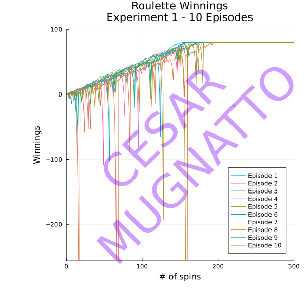
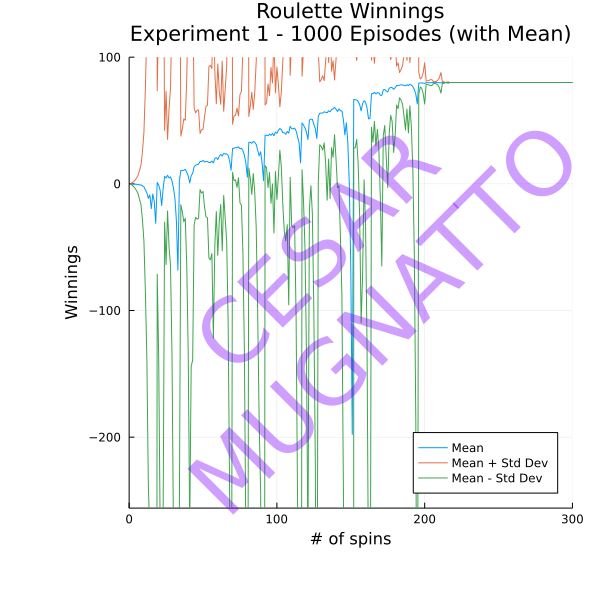
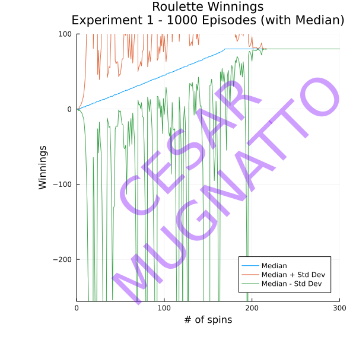
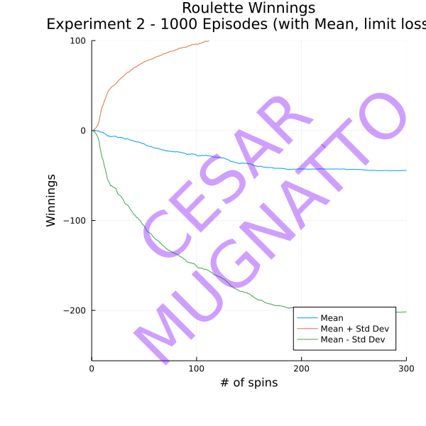
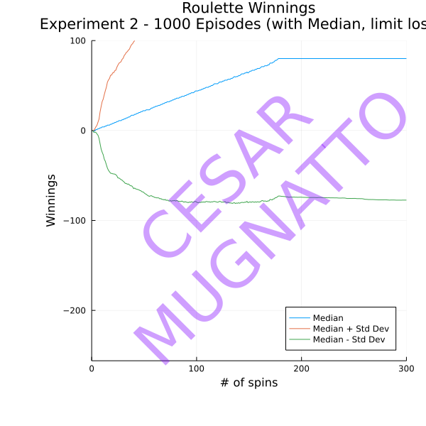

# Julia simulator for the Martingale Betting Strategy
Continuing in my quest to learn how to program in Julia that I started with [Experimenting_with_Julia_language](https://github.com/cesinco/Experimenting_with_Julia_language), this time I decided to work on a Julia language implementation of the Martingale Betting Strategy, specifically as it applies to American Roulette.

## Brief Description

I was unfamiliar with this strategy (described more completely at [wikipedia](https://en.wikipedia.org/wiki/Martingale_%28betting_system%29)) until recently when I had to implement this as a simulation using Python. This strategy can be used for any betting game where both the odds of winning and the payout are (approximately) 2:1. So in American Roulette, it can be applied to betting on red (or black), even (or odd), high (or low), or in fact, mixing every sequential bet up with any of those options. For the sake of simplicity, let's asusme that we always bet on black coming up on each spin of the wheel.

The strategy holds that whenever we win the bet, the next amount bet will be reset to $1, regardless of what the previous bet amount was. Should we lose a bet, we double the previous amount of the bet, also regardless of what the previous bet amount was. It can easily be demonstrated that our accumulated winnings grow by exactly $1 with every win. For example, the sequence:

won, won, lost, lost, won

would result in amount bet per round equivalent to (assuming we always bet $1 in the first round):

$1, $1, $1, $2, $4

and with the accumulated winnings (losses) equivalent to:

$1, $2, $1, ($1), $3

Continuing the same sequence as above as in the table below would generate an accumulated total of $5 (due to having 5 wins within the sequence)

|  | Round 1 | Round 2 | Round 3 | Round 4 | Round 5 | Round 6 | Round 7 | Round 8 | Round 9 | Round 10 | Round 11 |
|---------------|---------|---------|---------|---------|---------|---------|---------|---------|---------|----------|----------|
| Bet Amount    | $1      | $1      | $1      | $2      | $4      | $1      | $2      | $1      | $2      | $4       | $8       |
| Result        | won     | won     | lost    | lost    | won     | lost    | won     | lost    | lost    | lost     | won      |
| Accumulated   | $1      | $2      | $1      | ($1)     | $3      | $2      | $4      | $3      | $1      | ($3)      | $5       |

The American Roulette wheel contains 38 slots, numbered 1 through 36 where these numbers are distributed among red and black colors, and two additional slots 0 and double 0, colored green. This means that in American Roulette (where the House always wins on the green-colored slots 0 and 00), the payout of 2:1 happens with odds of 38:18, giving the House a slight advantage on each spin.

## The Experiments

Define an "episode" as a sequence of 1,000 spins of the wheel during which we apply the Martingale Betting Strategy described above, betting $1 every time we win on the previous round, and doubling the amount we bet before when losing, and continuing until we hit a predefined target amount of $80.

1. Determine what the expected value of our winnings by the end of the 1,000th spin, and considering that we have unlimited funds for betting. If we accumulate winnings of the target amount of $80, we "walk away from the roulette table", pocketing our winnings. Any remaining rounds of the 1,000 would show this $80 amount.

2. Determine what the expected value of our winnings by the end of the 1,000th spin, and considering that we have a limited bankroll of $256. If we accumulate winnings of the target amount of $80, we "walk away from the roulette table", pocketing our winnings. Equally, if we accumulate losses of the bankroll amount of $256, we "walk away from the table", broke. Any remaining rounds of the 1,000 would show either the target winnings of $80, or the accumulated losses limited by our bankroll.

For experiment 2, the only moderating factor on betting is that we cannot bet money that we don't have. So, if our bankroll + winnings (losses) = $117, and the simulation dictates that we must bet $128, we would have to trim our bet to $117 since this is the amount available to us.

## Implementation

One approach to implementing this would be to loop through up to 1,000 rounds, drawing from a Binomial distribution with the correct odds on each trial of the episode, and applying the logic to accumulate the winnings (losses). However, since this implementation was to be performed in Python (and Python being notoriously slow), another - faster - approach had to be found that could make use of numpy's vectorized operations.

This other approach would generate a numpy array containing 1,000 wins or losses based on a Bernoulli distribution using the same odds of winning. All operations on this array would also be performed using vectorized functions. Indeed, when first implemented in Python, this was the approach I used. Julia has built-in vectorized operations on arrays so it was natural to port this same approach to the Julia implementation.

## Results

Before performing a simulation that will contain 1,000 episodes, each with 1,000 trials i.e. spins of the wheel, let's see what the results of 10 individual episodes looks like. We'll focus on the most interesting bits of the simulation by capping the output to the first 300 trials on the X axis, keeping our winnings (losses) between the range of -256 and 100 on the Y axis.

### Initial trials

As can be seen by the chart below, the tendency is for all 10 episodes to increase their winnings over the first 300 trials, even when the losses are extreme, dipping well below the -$256 lower bound of the winnings. All 10 episodes eventually end up hitting the target of $80 by about the 200th trial.

### Experiment 1

Since we are now performing the experiment with 1,000 episodes, rather than displaying each one separately, we will display the mean winnings at each trial together with the standard deviation at each trial.

The above chart shows how the standard deviation of the winnings that starts out quite "tame", swings wildly after the first few trials, as the number of wins and losses diverge from one episode to the next, taking the accumulated winnings in different directions. This deviation begins to subside the closer we get to the 200th or so round as more and more of the episodes conclude by eventually hitting the $80 target, and disappears completely approximately by trial 220 by which time all 1,000 episodes have hit the target.

Contrast the chart immediately above showing the median winnings with the previous one showing the mean winnings. Despite still having the "erratic" behavior in the standard deviation, the median value of the "pot" shows a steadily rising value.

### Experiment 2

By introducing a loss-limiting threshold in experiment 2, one of the results is that it has a moderating effect on the standard deviation as can be seen in the next two charts.

The above chart shows how the standard deviation still widens after the first few trials, however due to its "moderating effect", the mean winnings are also less "erratic". In fact, this chart shows that over time (and in the real world, where people walk into casinos with a limited bankroll), the Martingale Betting Strategy will lose money over the long term, with the expected value of the pot tending asymptotically toward a value of about -$50 by the 300th trial.

The chart above showing the median winnings at each trial is a little deceptive and might encourage those who think the Martingale Betting Strategy is a winner. Although the median line trends upwards eventually settling at $80, the median disguises the fact that while we may win more often than we lose, our losses are more costly than the payoff earned from winning.

## Challenges and lessons learned with Julia implemention

Being a novice Julia programmer (currently!), there was much to learn when developing this simulation.

### Parameter passing in functions

Perhaps there are other ways of implementing this, but I wanted to simultaneously use a type declaration with parameters to guarantee that a function would be called with the correct type being passed in, but allow some of these parameters to take on a value of Nothing (either by being passed in explicitly, or as a default value). I learned about using the Union{} syntax to allow multiple types to be used as parameters.

### Plotting

For me, plotting in Julia was something I had never done before, and plotting represents a series of challenges not least by the number of technologies that can be used to generate plots.

One goal I had specifically in this implementation was the ability to watermark my images, something I had been doing in my Python code for some time already, but had to learn how to do in Julia. This inclued not just how to apply text to the plot, but also how to set the size, rotation, color and transparency/opacity/alpha.

Additional challenges included basic tasks such as generating a legend and placing it correctly, setting margins around the plot, and even how to plot multiple series' on a single plot. Yes - these are all basic tasks, but for a novice like me, it represented some challenges.

### Matrix vs Vector

Among the many articles and posts I read on the subject, a Julia matrix is computationally expensive when adding a new row since matrices in Julia are stored in column order (not row order as in Python). Knowing this, I instead first tried to implement the data structure as a vector of vectors, but this had its own problems, not least of which was plotting. In the end, I did use a Julia matrix, declaring it the size I need up front, and then updating the values with each episode created.

### Operations on Iterables

Some of the operations I had to learn in order to develop this simulation are things like cumulative sum (cumsum), and the Iterators.accumulate() function. These helped to keep a running total of the value of our "pot" of winnings (since we made the decision not to use looping within the episode to loop over each trial).

## Useful Links

https://mathigon.org/course/programming-in-julia/plotting  
https://data1010.github.io/docs/cheatsheets/plotsjl-cheatsheet.pdf  
https://docs.juliaplots.org/latest/tutorial/  
https://docs.juliaplots.org/latest/backends/  
http://docs.juliaplots.org/latest/  
https://syl1.gitbook.io/julia-language-a-concise-tutorial/useful-packages/plotting  
https://www.math.purdue.edu/~allen450/Plotting-Tutorial.html  
https://github.com/jheinen/GR.jl  
https://gr-framework.org/tutorials/index.html  
https://www.tutorialkart.com/julia/save-plot-png-jpeg-julia/  
http://docs.juliaplots.org/latest/attributes/  
http://docs.juliaplots.org/latest/colors/ Note that colors can be declared as RGBA meaning that opacity/transparency can be specified  
http://docs.juliaplots.org/latest/generated/gr/  
http://docs.juliaplots.org/latest/generated/plotly/  
https://docs.juliaplots.org/latest/generated/attributes_plot/  
https://docs.juliaplots.org/latest/generated/attributes_series/  
https://docs.juliaplots.org/latest/generated/attributes_axis/  
https://www.juliabloggers.com/using-julia-for-data-science-part-03-plotting/  
https://plotly.com/julia/text-and-annotations/  
https://github.com/JuliaPlots/Plots.jl/blob/master/src/examples.jl  
https://discourse.julialang.org/t/problem-using-margin-on-plots/16226  
https://scls.gitbooks.io/ljthw/content/_chapters/06-ex3.html  